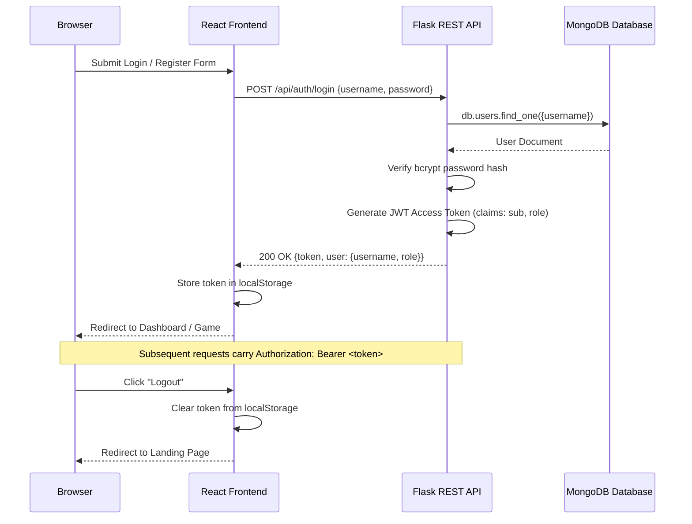

# 🔤 Guess the Word — Full-Stack Wordle-Style Game

A feature-packed, production-ready 5-letter word puzzle application built with **React (Vite)**, **Flask**, **MongoDB**, and **Gemini LLM / Free Dictionary APIs**.

---

## 📌 Table of Contents
- [🌐 Live Demo](#-live-demo)
- [✨ Key Features](#-key-features)
- [🔐 Authentication Flow](#-authentication-flow)
- [⚙️ Request Flow](#️-request-flow)
- [🔗 API Endpoints Reference](#-api-endpoints-reference)
- [✅ Requirements Coverage](#-requirements-coverage)
- [🚀 Beyond the Requirements](#-beyond-the-requirements)
- [🧠 Design Decisions](#-design-decisions)
- [🏗️ Architecture](#️-architecture)
- [🗂️ Data Model](#️-data-model)
- [🔒 Role-Based Access Control (RBAC)](#-role-based-access-control-rbac)
- [📁 Project Structure](#-project-structure)
- [⚡ Setup & Local Development](#-setup--local-development)
- [☁️ Deployment (Vercel)](#️-deployment-vercel)

---

## 🌐 Live Demo

| Surface | URL / Access |
| :--- | :--- |
| 🎮 **Frontend App** | [guess-the-word.vercel.app](https://guess-word-dun.vercel.app/) |
| 🗄️ **Database** | MongoDB Atlas Cloud Cluster |

### Demo Credentials
| Role | Username | Password | Access Level |
| :--- | :--- | :--- | :--- |
| 👑 **Admin** | `Admin1` | `Admin1$` | Full Admin Control & Analytics Dashboard |
| 👤 **Player** | `Player1` | `Player1$` | 3 Daily Games, Stats, & Consistency Heatmap |

---

## ✨ Key Features

- 🎮 **3 Game Difficulty Modes**:
  - **🟢 Easy Mode**: Unlimited time (`∞ No Limit`), common 5-letter vocabulary.
  - **🟡 Medium Mode**: **5-Minute Countdown Timer** (`⏱️ 05:00`), medium vocabulary.
  - **🔴 Hard Mode**: **3-Minute Countdown Timer** (`⏱️ 03:00`), hard vocabulary + **💡 Word Meaning Hint Option**.
- 🤖 **AI & LLM Word Verification**: Integrates **Gemini REST API** and **Free Dictionary API** to validate every 5-letter guess while strictly rejecting non-words (e.g., `ADGHT`).
- 💡 **Word Meaning Clues**: Integrated definition engine in Hard mode offering dictionary definition hints for vocabulary building.
- 🔥 **30-Day Consistency Heatmap**: Interactive 3-row × 10-column activity grid tracking games played daily with color intensity levels (`Less ... More (Max 3/day)`).
- 👑 **Admin Analytics Portal**: Dedicated admin view featuring a 5-day date filter bar, total active users, games played, games won, per-user victory tables, and an interactive 30-day heatmap inspector modal. Game access is disabled for admins.
- 🎨 **Animated Landing Page**: Features an animated 5x5 grid preview simulating live step-by-step typing and 3D flip reveals for the target word `PLANT`.

---

## 🔐 Authentication Flow



---

## ⚙️ Request Flow

```
Browser ──> React Page (Vite) ──> API Client (apiFetch) ──> Flask Route Handler
                                                                   │
                                                        ┌──────────▼───────────┐
                                                        │  Dependency Chain    │
                                                        │                      │
                                                        │  get_db()            │  <── PyMongo Client Connection
                                                        │  jwt_required()      │  <── Bearer Token ──> Identity
                                                        │  role_check()        │  <── Role == "admin" (Admin Only)
                                                        └──────────┬───────────┘
                                                                   │
                                                        ┌──────────▼───────────┐
                                                        │  Service Layer       │
                                                        │                      │
                                                        │  word_validation.py  │  <── Gemini LLM & Dictionary API
                                                        │  word_hints.py       │  <── Definition Hint Lookup
                                                        │  models.py           │  <── Vocab Pool & Session Logic
                                                        └──────────┬───────────┘
                                                                   │
                                                        ┌──────────▼───────────┐
                                                        │  MongoDB Database    │
                                                        │  (PyMongo Driver)    │
                                                        └──────────┬───────────┘
                                                                   │
                                                            MongoDB Atlas
```

---

## 🔗 API Endpoints

Base URL: `http://<BACKEND_URL>/api`

### Auth (4 endpoints)
| Method | Endpoint | Auth | Description |
| :--- | :--- | :--- | :--- |
| `POST` | `/auth/register` | 🔓 | Register a new player account |
| `POST` | `/auth/login` | 🔓 | Login → creates session → issues JWT token |
| `POST` | `/auth/logout` | 🔒 | Logout → clears session token |
| `GET` | `/auth/me` | 🔒 | Get current authenticated user details |

### Game (6 endpoints)
| Method | Endpoint | Auth | Description |
| :--- | :--- | :--- | :--- |
| `POST` | `/game/start` | 🔒 | Start a new game (enforces 3/day limit & difficulty mode) |
| `POST` | `/game/guess` | 🔒 | Submit a 5-letter guess validated via Gemini LLM API |
| `GET` | `/game/current` | 🔒 | Get active in-progress game session |
| `GET` | `/game/{id}` | 🔒 | Get a specific game session state |
| `GET` | `/game/user-stats` | 🔒 | Get player stats (wins, streak, 30-day heatmap grid) |
| `GET` | `/game/history` | 🔒 | Get all completed games with full attempt history |

### Settings (3 endpoints)
| Method | Endpoint | Auth | Description |
| :--- | :--- | :--- | :--- |
| `GET` | `/settings/check-username/{name}` | 🔒 | Live username availability check |
| `PUT` | `/settings/profile` | 🔒 | Update display name / username |
| `PUT` | `/settings/password` | 🔒 | Change password (requires current password) |

### Admin (9 endpoints)
| Method | Endpoint | Auth | Description |
| :--- | :--- | :--- | :--- |
| `GET` | `/admin/overview` | 👑 | Overview summary stats & 5-day daily user breakdown |
| `GET` | `/admin/report/daily` | 👑 | Daily report — users, games, correct guesses (`?date=YYYY-MM-DD`) |
| `GET` | `/admin/report/daily-range` | 👑 | Date range report (`?from_date=...&to_date=...`) |
| `GET` | `/admin/report/user/{id}` | 👑 | User report — date, words tried, correct guesses |
| `GET` | `/admin/users` | 👑 | List all users (search, sort, filter) |
| `PUT` | `/admin/users/{id}` | 👑 | Edit user (name, username, role, password) |
| `DELETE` | `/admin/users/{id}` | 👑 | Delete user (cascades games & guesses) |
| `GET` | `/admin/words` | 👑 | List all words in dictionary |
| `POST` | `/admin/words` | 👑 | Add a new 5-letter word |
| `DELETE` | `/admin/words/{id}` | 👑 | Remove a word from dictionary |

`🔓 = Public` &nbsp;&nbsp;&nbsp;&nbsp; `🔒 = Authenticated (any role)` &nbsp;&nbsp;&nbsp;&nbsp; `👑 = Admin only`

---

## ✅ Requirements Coverage

| # | Specification Requirement | Status | Implementation Details |
| :-: | :--- | :-: | :--- |
| 1 | **Two User Roles** (Admin & Player) | ✅ | Role-based navigation and JWT claims. Admins access the control portal; Players access the game & dashboard. |
| 2 | **User Registration & Authentication** | ✅ | Password hashing via `bcrypt` and token authorization via `Flask-JWT-Extended`. |
| 3 | **Username Validation** | ✅ | Enforces at least 5 letters with mixed uppercase and lowercase letters. |
| 4 | **Password Validation** | ✅ | Enforces at least 5 characters containing letters, numbers, and special characters (`$`, `%`, `*`, `&`, `@`). |
| 5 | **Initial 20 5-Letter Words** | ✅ | `seed.py` pre-loads 20+ words categorized across Easy, Medium, and Hard vocabulary tiers. |
| 6 | **Random Word Pick** | ✅ | Random selection based on user-chosen difficulty mode (`easy`, `medium`, `hard`). |
| 7 | **3 Games Per Day Limit** | ✅ | Enforced server-side per UTC date (`games_left_today`). |
| 8 | **5-Letter Uppercase Guessing (Max 5 attempts)** | ✅ | Interactive virtual keyboard and input validation enforcing 5 letters and max 5 attempts. |
| 9 | **Green Tile Feedback** | ✅ | Correct letter in the correct position. |
| 10 | **Orange Tile Feedback** | ✅ | Correct letter in the wrong position. |
| 11 | **Grey Tile Feedback** | ✅ | Letter not present in the target word. |
| 12 | **Victory Screen** | ✅ | Winning celebration modal on correct guess (`status == 'won'`). |
| 13 | **Loss Screen** | ✅ | Better luck next time modal revealing the target word when 5 attempts or timer expire (`status == 'lost'`). |
| 14 | **Previous Guess History** | ✅ | Color-coded grid rendering past attempts in sequence. |
| 15 | **Database Storage** | ✅ | Persistent storage in MongoDB Atlas for users, words, and game sessions with dates. |
| 16 | **Admin Daily Report** | ✅ | Daily report endpoint returning active player counts, games played, and daily wins. |
| 17 | **Admin Per-User Report** | ✅ | Detailed per-user activity stats and 30-day heatmap inspector. |

---

## 🚀 Beyond the Requirements

- ⏱️ **Live Countdown Timers**: Real-time JavaScript timer in Medium (5m) and Hard (3m) modes with pulsing red warning animations under 30 seconds.
- 💡 **AI-Generated Hints & Meanings**: Live definition lookups via Gemini API & Free Dictionary API with local database fallbacks.
- 📅 **5-Day Date Filter Bar**: Allows admins to switch between the last 5 days of activity seamlessly.
- 🔍 **Heatmap Inspector Modal**: Dedicated modal for admins to inspect any player's 30-day consistency grid without leaving the daily summary.
- 🎨 **Fluid Responsive Dark Theme**: Function-driven dark UI styling using native CSS custom properties.

---

## 🧠 Design Decisions

| Decision | Rationale |
| :--- | :--- |
| **React (Vite) Frontend** | Lightning-fast HMR and modular component architecture (`AuthCard`, `GameCard`, `GamePage`, `AdminDashboard`). |
| **Flask + PyMongo Backend** | Lightweight Python framework with flexible JSON document modeling suitable for game sessions and rapid serverless execution. |
| **Vercel Serverless Rewrites** | Single repository deployment where Flask routes function as serverless functions in `frontend/api/index.py`. |
| **Gemini REST + Dictionary API Integration** | Hybrid dictionary lookup ensuring valid 5-letter English words while providing definitions for hint lookups. |
| **JWT Authorization** | Stateless authentication passed via HTTP Bearer headers for clean API security. |

---

## 🏗️ Architecture

```
┌──────────────────────────────────────────┐         ┌──────────────────────────────────────────┐
│           React Frontend (Vite)          │         │         Flask REST API Backend           │
│                                          │         │                                          │
│  - LandingPage (Animated 5x5 Typing)    │  HTTPS  │  - Auth Routes (/api/auth/*)             │
│  - AuthCard (Login / Signup Validation) │ ──────> │  - Game Routes (/api/game/*)             │
│  - GameCard (Dashboard & Heatmap)       │         │  - Admin Routes (/api/admin/*)           │
│  - GamePage (Live Timer & Word Hints)   │         │  - Word Validation & Definition Engine   │
│  - AdminDashboard (5-Day Date Filter)   │         └────────────────────┬─────────────────────┘
└──────────────────────────────────────────┘                              │
                                                                          ▼
                                                     ┌──────────────────────────────────────────┐
                                                     │         MongoDB Atlas Cloud DB           │
                                                     │                                          │
                                                     │  Collections: users, words, sessions     │
                                                     └──────────────────────────────────────────┘
```

---

## 🗂️ Data Model

### Collections
- **`users`**: `{ _id, username, password_hash, role ("player" | "admin"), created_at }`
- **`words`**: `{ _id, word, difficulty ("easy" | "medium" | "hard") }`
- **`sessions`**: `{ _id, user_id, username, target_word, guesses, status ("playing" | "won" | "lost"), mode, date, created_at }`

---

## 🔒 Role-Based Access Control (RBAC)

| Resource / Endpoint | Player | Admin |
| :--- | :-: | :-: |
| Register / Login | ✅ | ✅ |
| Play Game (Start, Guess, Timer) | ✅ | ❌ |
| View Personal 30-Day Heatmap & Stats | ✅ | ❌ |
| View Admin Summary Metrics | ❌ | ✅ |
| Access 5-Day Date Filter & User Victory Log | ❌ | ✅ |
| Inspect Player Heatmaps via Modal | ❌ | ✅ |

---

## 📁 Project Structure

```
├── backend/
│   ├── app.py                # Main Flask REST API application & endpoints
│   ├── models.py             # MongoDB schema helpers & query operations
│   ├── word_validation.py    # Gemini LLM & Free Dictionary API word validator
│   ├── word_hints.py         # Word definition hint engine
│   ├── seed.py               # Seed script pre-loading words & admin/player accounts
│   └── requirements.txt      # Python dependencies
│
├── frontend/
│   ├── src/
│   │   ├── components/
│   │   │   ├── Auth/         # AuthCard login & registration forms
│   │   │   ├── Game/         # GameCard dashboard, GamePage, GameGrid, Keyboard
│   │   │   ├── Landing/      # Animated LandingPage & live typing preview
│   │   │   ├── Modal/        # GameModal win/loss dialogs
│   │   │   ├── Reports/      # AdminDashboard, 5-day selector, & Heatmap Modal
│   │   │   └── Header/       # App Navigation Bar
│   │   ├── api.js            # Frontend API client SDK
│   │   ├── App.jsx           # Root React Shell & state router
│   │   └── main.jsx          # Vite React entry point
│   ├── api/                  # Vercel serverless Python functions
│   └── vercel.json           # Vercel deployment configuration
│
└── README.md
```

---

## ⚡ Setup & Local Development

### Prerequisites
- Python 3.9+
- Node.js 18+
- MongoDB instance (Local or Atlas)

### 1. Backend Setup
```bash
cd backend
pip install -r requirements.txt

# (Optional) Set environment variables in backend/.env
# MONGO_URI="mongodb://localhost:27017/wordguess"
# JWT_SECRET_KEY="your_jwt_secret"
# GEMINI_API_KEY="your_gemini_key"

python seed.py    # Seeds 20+ words and default users
python app.py     # Runs Flask backend on http://127.0.0.1:5000
```

### 2. Frontend Setup
```bash
cd frontend
npm install
npm run dev       # Runs Vite frontend on http://localhost:5173
```

---

## ☁️ Deployment (Vercel)

1. Push your repository to GitHub.
2. Import the repository on [Vercel](https://vercel.com).
3. Set **Root Directory** to `frontend`.
4. Add the following Environment Variables in Vercel settings:
   - `MONGO_URI`: Your MongoDB Atlas connection string.
   - `JWT_SECRET_KEY`: Secure secret string for JWT authentication.
   - `GEMINI_API_KEY`: (Optional) Google Gemini API Key for live word validation and hint lookups.
5. Deploy! Vercel will handle both static React assets and Python serverless functions via `api/index.py`.

---

<p align="center">
  Built with ❤️ · 2026
</p>
